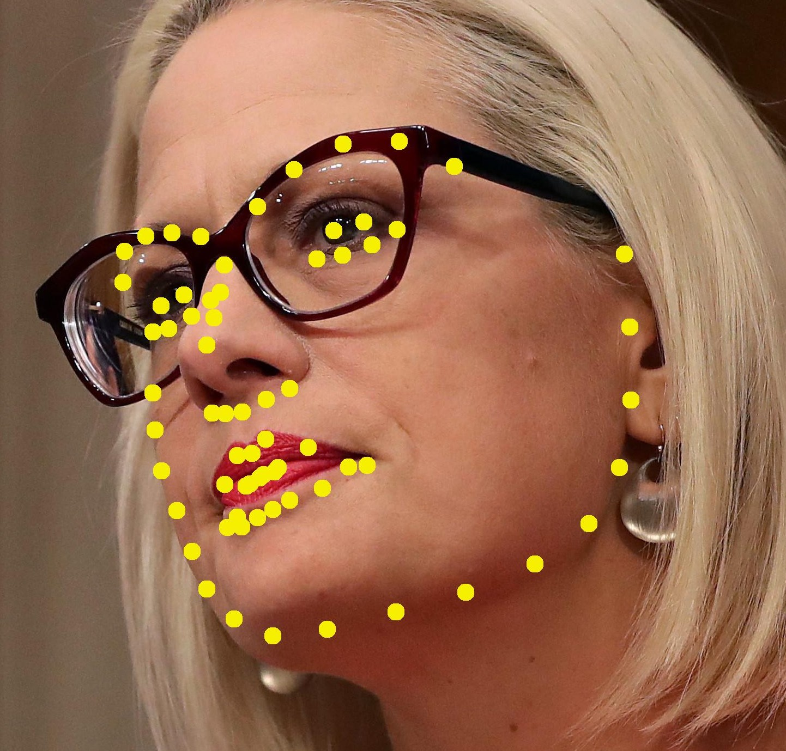
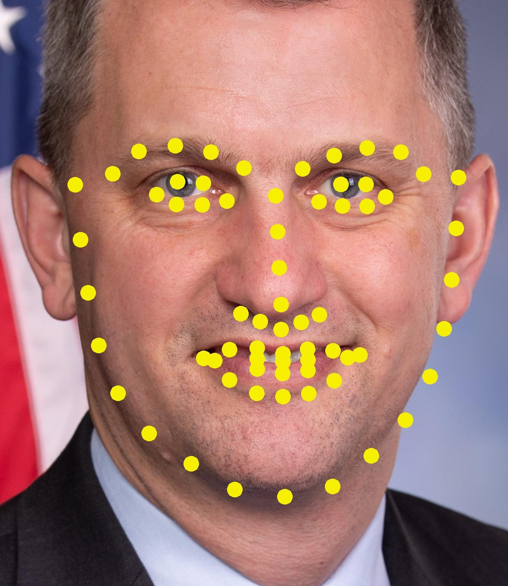
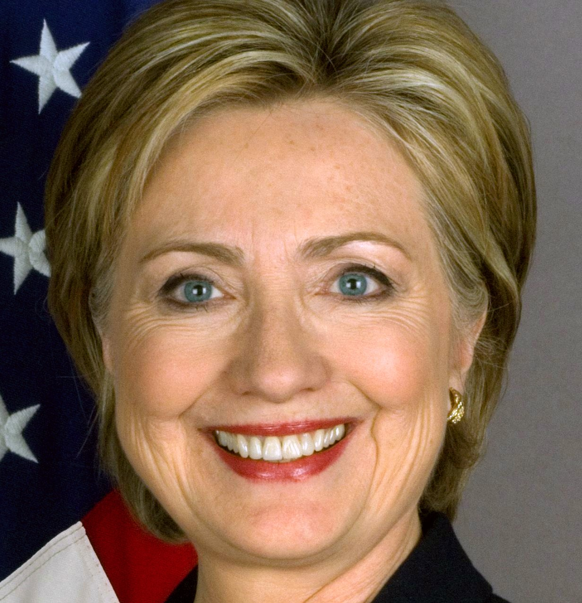
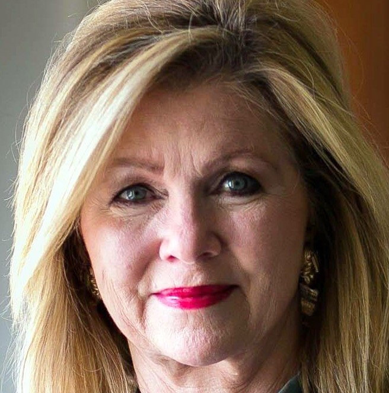
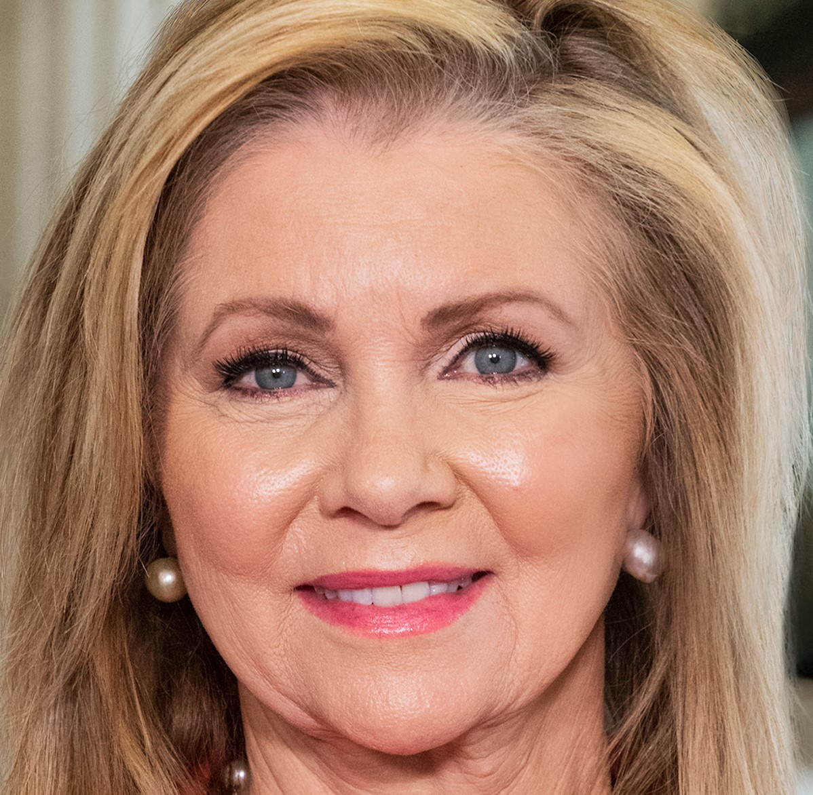

Getting Started
===============

The purpose of this guide is to illustrate some of the main features that 
``wmp-face`` provides. Please refer to our :ref:`installation 
instructions <installation_instructions>`

``wmp-face`` is a Python module for face detection & recognition built on top 
of dlib's facial recognizer. It also provides tools for visualizing results - 
montages, facemarks. 

Detection
---------

Detecting where a face is located within the image is always the first step of 
facial recognition. To detect a face in an image, and crop out the face 
thumbnails::

    $ fd = detect.FaceDetector()  # can be different detectors
    $ face_image = detect.FaceImage(IMG)
    $ face_image_results = fd.find_faces(face_image)
    $ face_image_results.write_faces(OUTDIR)

Recognition
-----------

There are billions of human faces on the planet. To make face recognition even 
more difficult, most faces  share similar shapes and textures. Deep learning 
face recognition models quantifies the faces, constructing an embedding 
(quantification) for an individual face.

To encode our reference faces::

    $ fd = detect.FaceDetector()

    $ portraits = utils.glob(REF_DIR, "[\w]+.jpg")
    $ reference_images = [detect.FaceImage(p) for p in portraits]

    $ encoded_faces = [fd.find_faces(r).faces[0] for r in reference_images]
    $ reference_batch = detect.FaceBatch(encoded_faces, is_reference=True)

To recognize an unknown face in a new photo::

    $ fd = detect.FaceDetector()
    $ fr = detect.FaceRecognizer(ENCODED_REF_DIR)

    $ face_image = detect.FaceImage(NEW_IMG)
    $ face_image = fd.find_faces(face_image)  # FaceImage
 
    $ face_image = fr.predict_names(face_image)
    $ print(face_image.retrieve_names())

Verification
------------

We create a labelled dataset by taking the initial results of dlib and 
generating folders for each person of interest. We will then place all the 
cropped faces found by dlib into these folders along with a verified image of 
the person of interest. Then we go through each  of the folders to manually 
spot any faces that do not belong to a person. Any faces of random people will
be placed in the unknown folder.

To place face thumbnails of detected/recognized faces into the correct folder::

    $ face_image_results.write_faces(OUTDIR, marked=True)