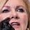

.. _recognizing_face_batch_tutorial:

================================
Recognizing faces in large batch
================================

The goal of this guide is to explore some of the main ``wmp-face`` tools on a 
single task: recognizing all the faces in a batch of images

In this tutorial, we will see how to:

  - load all images of your persons-of-interest

  - extract feature vectors of your persons-of-interest and store for future 
    use

  - load all images you want to analyze 

  - perform face detection and recognition on images

  - verify results of face algorithms by hand

Tutorial setup 
---------------

To get started with this tutorial, you must first install *wmp-face* and all of 
its required dependencies. Please refer to the 
:ref:`installation instructions <installation_instructions>`
page for more information and for system-specific instructions. The source of 
this tutorial can be found `on Github
<https://github.com/wmp-face/tree/master/doc/tutorial>`_.

The data we will be using are 1) images of renowned politicians grabbed from 
Google images to be used as reference photos and 2) a small sample of Facebook 
political ads which we will be using to illustrate how effective the face 
recognition algorithm is. Check out this `short video 
<https://www.youtube.com/watch?v=agGEDdj05U0>`_ for a quick overview of face
detection and face recognition. 

Loading images of your persons-of-interest
-------------------------------------------

To be able to recognize a face in an image we haven't seen before, we need to 
have photos of our persons-of-interest (i.e. reference photos). 

In the following, we will use the built-in dataset loader from wmp-face::

  >>> from wmp.datasets import fetch_referenceportraits
  >>> images_filepaths = fetch_referenceportraits()

The returned object is a list of file paths to our reference portraits::

  >>> images_filepaths
  ['data/ref/Bernie_Sanders.jpg', 'data/ref/Donald_Trump.jpg', 
   'data/ref/Hillary_Clinton.jpg', 'data/ref/Marsha_Blackburn.jpg']

We can now load the list of files into ``FaceImage`` objects which will allow
us to store the image data and eventually detect all the faces contained in the
image::

  >>> fromp wmp import detect
  >>> images = [detect.FaceImage(i) for i in images_filepaths]
  >>> images[3].show()

Extracting and storing features of your persons-of-interest
-----------------------------------------------------------

Now that we have all our reference photos loaded, we need to 1) detect where 
exactly in the photo a face is located and 2) encode the found face into an 
n-dimensional vector understood by our recognition algorithm. These are handled
by our ``FaceDetector`` object. 

Let's detect and encode a face in a single reference photo::

  >>> fd = detect.FaceDetector()
  >>> image1 = images[3]
  >>> len(image1.faces)
  0
  >>> image1 = fd.find_faces(image1)
  >>> len(image1.faces)
  1

We have found 1 face in the image. Notice that ``find_faces()`` method takes 
a ``FaceImage`` as an argument and returns a modified ``FaceImage`` that has a 
``faces`` attribute. The ``faces`` attribute is a list of ``Face`` objects. 
Let's explore a single ``Face``

  >>> face1 = image1.faces[0]
  >>> face1
  Face(source_name=data/ref/Marsha_Blackburn.jpg,box=Box(top=376,left=1274,bottom=761,right=1659))
  >>> face1.encoding
  [ -0.10275392  0.05789899  0.1129996  -0.09764827 -0.08509253  0.00112197
    0.05602    -0.04875868  0.16560641 -0.083772    0.16726318 -0.08173679
    ... ]
  >>> face1.encoding.shape
  (128,)
  >>> face1.show()

  

Now that we have a better handle on what ``FaceDetector`` does, let's repeat 
``find_faces()`` over all our reference photos. 

  >>> faces = [fd.find_faces(i).faces[0] for i in images]
  >>> faces
  [ Face(source_name=data/ref/Bernie_Sanders.jpg,box=Box(top=231,left=200,bottom=498,right=468)), 
    Face(source_name=data/ref/Donald_Trump.jpg,box=Box(top=872,left=798,bottom=1538,right=1463)),
    ... ]

Next, lets turn the list of ``Face`` into a reference ``FaceBatch`` and save 
for future use.

  >>> reference_batch = detect.FaceBatch(faces, is_reference=True)
  >>> len(reference_batch.faces)
  4
  >>> reference_batch.encodings.shape
  (4, 128)
  >>> reference_batch.true_names
  [ Bernie_Sanders, Donald_Trump, Hillary_Clinton, Marsha_Blackburn ]
  >>> reference_batch.save("data/reference_encoded")

Pay close attention to the attributes of our ``FaceBatch``. We had four 
reference photos. Therefore, we expect our ``FaceBatch`` to have four faces, 
four encodings and four names. 

Output folder structure
~~~~~~~~~~~~~~~~~~~~~~~~~~~~~~~

Finally, we will examine the folder structure of our saved reference 
``FaceBatch``. ``reference_batch.p`` is our previous ``FaceBatch`` object that 
contains the names and encodings from our reference photos. We will be loading
this object into our ``FaceRecognizer``. 

A copy of each of our reference photos (now named *_reference.jpg*) has been 
placed into a folder of the same name. Additionally, the folders *No_Person* 
and *Unknown* have been created. We will be using these pictures and folders 
when we :ref:`verify the face results <verifying_face_results>`::

  reference_encoded
  │   reference_batch.p
  │
  ├───Bernie_Sanders
  │       _reference.jpg
  │
  ├───Donald_Trump 
  │       _reference.jpg
  │
  ├───Hillary_Clinton
  │       _reference.jpg
  │
  ├───Marsha_Blackburn
  │       _reference.jpg
  │
  ├───No_Person
  └───Unknown

We're now ready to recognize faces in new images!

Loading images for analysis
------------------------------

Let's load in our new images using the built-in dataset loader from wmp-face.::

  >>> from wmp.datasets import fetch_facebookads
  >>> images_filepaths = fetch_facebookads()

The returned object is a list of file paths to our images::

  >>> images_filepaths
  [ 'data/fb/106600513605104.jpg', 'data/fb/172300446975609_sshot.jpg', ... ]

We can now load the list of files into ``FaceImage`` objects which will allow
us to store the image data and eventually detect all the faces contained in the
image::

  >>> fromp wmp import detect
  >>> images = [detect.FaceImage(i) for i in images_filepaths]
  >>> images[7].show()

Performing detection and recognition
-----------------------------------------------

Let's detect and recognize faces in a single photo::

  >>> fd = detect.FaceDetector()
  >>> fr = detect.FaceRecognizer("data/reference-encoded")
  >>> image1 = images[7]

  >>> image1 = fd.find_faces(image1)
  >>> image1 = fr.predict_names(image1)
  >>> image1.retrieve_names()
  [ Donald_Trump, Marsha_Blackburn ]
  >>> image1.write_faces("data/outfaces")

We've detected and recognized two faces. To visualize the results, we see
the folder *data/outfaces* will contain::

  outfaces
      Donald_Trump_0.jpg
      Marsha_Blackburn_1.jpg

|pic1| |pic2|

Now that we understand what ``FaceRecognizer`` does, let's repeat 
``predict_names()`` across all our photos::

  >>> images = [fd.find_faces(i) for i in images]  
  >>> images = [fr.predict_names(i) for i in images]
  >>> names = [i.retrieve_names() for i in images]
  [ ['Donald_Trump', 'Marsha_Blackburn'], [], ['Unknown', 'Bernie_Sanders'], ... ]
  >>> fr.write_validation(images, "data/outfaces")

To visualize the results, we see the folder *data/outfaces* will contain::

  outfaces:.
  │   reference_batch.p
  │
  ├───Bernie_Sanders
  │       172300446975609_image_1.jpg
  │       172300446975609_sshot_1.jpg
  │       _reference.jpg
  │
  ├───Donald_Trump
  │       1048748175284984_image_0.jpg
  │       1048748175284984_sshot_0.jpg
  │       372009193308190_image_1.jpg
  │       _reference.jpg
  │
  ├───Hillary_Clinton
  │       _reference.jpg
  │
  ├───Marsha_Blackburn
  │       1048748175284984_image_1.jpg
  │       1048748175284984_sshot_1.jpg
  │       _reference.jpg
  │
  ├───No_Person
  │       1048748175284984_sponsor.jpg
  │       270469526847559_image.jpg
  │
  └───Unknown
          106600513605104_image_0.jpg
          106600513605104_image_1.jpg
          106654180210343_image_0.jpg
          106654180210343_image_1.jpg
          106654180210343_image_2.jpg
          106654180210343_image_3.jpg
          172300446975609_image_0.jpg
          172300446975609_sshot_0.jpg
          372009193308190_image_0.jpg

We've completed recognizing all the faces in these images! Now its time to
:ref:`validate the results <verifying_face_results>`