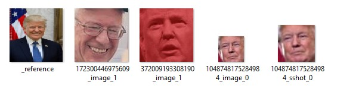

.. _verifying_face_results:

==================================================
Manually verifying facial recognition results
==================================================

The goal of this guide is to explore some of the main ``wmp-face`` tools on a 
single task: recognizing all the faces in a batch of images

In this tutorial, we will see how to:

  - move images to correct classification

  - compare predictions to validated set

Tutorial setup
--------------

To get started with this tutorial, you must first install *wmp-face* and all of 
its required dependencies. Please refer to the 
:ref:`installation instructions <installation_instructions>`
page for more information and for system-specific instructions. The source of 
this tutorial can be found `on Github
<https://github.com/wmp-face/tree/master/doc/tutorial>`_.

This tutorial requires the completion of the previous tutorial
:ref:`Recognizing faces in large batch <recognizing_face_batch_tutorial>`.

Some of these **face thumbnails** are misclassified. Our validation task 
requires us to 1) store the current state of *data/outfaces* 2) then move the
files using **_reference.jpg** as a guide to know which **face thumbnails** 
belong in that folder and 3) store the modified state of *data/outfaces* and 
compare the accuracy

Moving images to correct classification
-----------------------------------------

We left off the previous tutorial with the folder *data/outfaces* containing::

  outfaces:.
  │   reference_batch.p
  │
  ├───Bernie_Sanders
  │       172300446975609_image_1.jpg
  │       172300446975609_sshot_1.jpg
  │       _reference.jpg
  │
  ├───Donald_Trump
  │       1048748175284984_image_0.jpg
  │       1048748175284984_sshot_0.jpg
  │       372009193308190_image_1.jpg
  │       _reference.jpg
  │
  ├───Hillary_Clinton
  │       _reference.jpg
  │
  ├───Marsha_Blackburn
  │       1048748175284984_image_1.jpg
  │       1048748175284984_sshot_1.jpg
  │       _reference.jpg
  │
  ├───No_Person
  │       1048748175284984_sponsor.jpg
  │       270469526847559_image.jpg
  │
  └───Unknown
          106600513605104_image_0.jpg
          106600513605104_image_1.jpg
          106654180210343_image_0.jpg
          106654180210343_image_1.jpg
          106654180210343_image_2.jpg
          106654180210343_image_3.jpg
          172300446975609_image_0.jpg
          172300446975609_sshot_0.jpg
          372009193308190_image_0.jpg

To store the current state of *data/outfaces*

  >>> from wmp import detect
  >>> fr = detect.FaceRecognizer("data/outface")
  >>> prev = fr.store_state()

At this point, we move the **face thumbnails** that are in the incorrect 
folders, to their appropriate folders. We use the **_reference.jpg** to know 
which belong in this folder. Below, we see a misplaced image of Bernie Sanders

Comparing predictions to validated set
--------------------------------------------

Now that we've completed our correction, we can find the accuracy::

  >>> now = fr.store_state()
  >>> fr.classification_report(prev, now)
                precision    recall  f1-score   support
  <BLANKLINE>
        Bernie_Sanders       1.00      0.67      0.80         3
        Donald_Trump         0.00      0.00      0.00         0
        Hillary_Clinton      0.00      0.00      0.00         0
        Marsha_Blackburn     0.00      0.00      0.00         0
        No_Person            0.00      0.00      0.00         0
        Unknown              0.00      0.00      0.00         0

  >>> fr.confusion_matrix(prev, now)
    array([[2, 0, 0],
        [0, 0, 1],
        [0, 0, 1],
        [0, 1, 1],
        [2, 0, 1],
        [1, 0, 2]])

